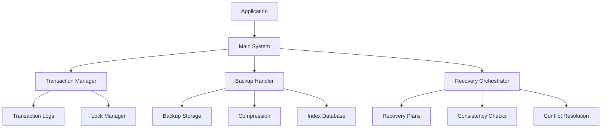

# Rollback Recovery Implementation Documentation

## Overview

This document provides comprehensive documentation for the Rollback and Recovery System, an enterprise-grade solution for managing data operations with robust rollback capabilities, backup/restore functionality, and disaster recovery procedures.

## Table of Contents

1. [System Architecture](#system-architecture)
2. [Core Components](#core-components)
3. [Transaction Management](#transaction-management)
4. [Backup and Restore](#backup-and-restore)
5. [Recovery Orchestration](#recovery-orchestration)
6. [Data Consistency](#data-consistency)
7. [Cross-Platform Support](#cross-platform-support)
8. [Installation and Setup](#installation-and-setup)
9. [Usage Examples](#usage-examples)
10. [API Reference](#api-reference)
11. [Troubleshooting](#troubleshooting)
12. [Best Practices](#best-practices)

## System Architecture

The Rollback Recovery System is built on a modular architecture with three main components:

### Component Overview

```
┌─────────────────────────────────────────────────────────────┐
│                 Rollback Recovery System                    │
├─────────────────────────────────────────────────────────────┤
│  Main System (main.py)                                      │
│  - Unified interface                                        │
│  - CLI and API                                              │
│  - System monitoring                                        │
├─────────────────┬─────────────────┬─────────────────────────┤
│ Transaction     │ Backup Handler  │ Recovery Orchestrator   │
│ Manager         │                 │                         │
│                 │                 │                         │
│ • ACID          │ • Snapshots     │ • Point-in-time         │
│ • Rollback      │ • Restore       │ • Disaster recovery     │
│ • Locks         │ • Compression   │ • Conflict resolution   │
│ • Deadlocks     │ • Validation    │ • Consistency checks    │
└─────────────────┴─────────────────┴─────────────────────────┘
```

### Data Flow



## Core Components

### 1. Transaction Manager (`transaction_manager.py`)

The Transaction Manager provides ACID-compliant transaction handling with advanced features:

#### Key Features

- **ACID Compliance**: Ensures Atomicity, Consistency, Isolation, and Durability
- **Multi-Database Support**: Handles transactions across different database types
- **Two-Phase Commit**: Implements distributed transaction protocol
- **Deadlock Detection**: Automatic detection and resolution of deadlocks
- **Lock Management**: Fine-grained locking with multiple isolation levels
- **Transaction Snapshots**: Point-in-time state capture for recovery

#### Isolation Levels

- `READ_UNCOMMITTED`: Lowest isolation, highest concurrency
- `READ_COMMITTED`: Default level for most operations
- `REPEATABLE_READ`: Prevents non-repeatable reads
- `SERIALIZABLE`: Highest isolation, lowest concurrency

#### Lock Types

- **Shared (S)**: Read locks, multiple can coexist
- **Exclusive (X)**: Write locks, blocks all others
- **Intention Shared (IS)**: Indicates intent to read
- **Intention Exclusive (IX)**: Indicates intent to write

### 2. Backup Handler (`backup_handler.py`)

The Backup Handler manages comprehensive backup and restore operations:

#### Key Features

- **Multiple Backup Types**: Full, incremental, differential, and snapshot backups
- **Compression**: Zstandard compression with configurable levels
- **Deduplication**: Eliminates duplicate data chunks
- **Chunking**: Intelligent data splitting for large files
- **Validation**: Checksum verification for data integrity
- **Retention Policies**: Automated cleanup based on configurable rules

#### Backup Types

1. **Full Backup**: Complete copy of all data
2. **Incremental Backup**: Only changes since last backup
3. **Differential Backup**: Changes since last full backup
4. **Snapshot Backup**: Point-in-time state capture

#### Storage Features

- **Compression Algorithms**: Zstandard (default), LZ4
- **Chunk Size**: Configurable (default: 1GB)
- **Integrity Verification**: SHA-256 checksums
- **Metadata Storage**: SQLite-based indexing system

### 3. Recovery Orchestrator (`recovery_orchestrator.py`)

The Recovery Orchestrator coordinates complex recovery operations:

#### Key Features

- **Point-in-Time Recovery**: Restore to any point in time
- **Disaster Recovery**: Automated disaster response procedures
- **Conflict Resolution**: Multiple strategies for handling data conflicts
- **Consistency Validation**: Comprehensive data integrity checks
- **Recovery Planning**: Detailed recovery plan generation
- **Cascading Recovery**: Multi-system coordinated recovery

#### Recovery Types

1. **Point-in-Time Recovery**: Restore to specific timestamp
2. **Transaction Rollback**: Undo specific transactions
3. **Full Restore**: Complete system restoration
4. **Partial Restore**: Selective data restoration
5. **Disaster Recovery**: Full system failover

#### Conflict Resolution Strategies

- **Fail Fast**: Stop on first conflict
- **Overwrite**: Replace conflicting data
- **Merge**: Combine conflicting data
- **Skip Conflicts**: Ignore conflicts and continue
- **Manual Review**: Flag conflicts for human review
- **Timestamp Based**: Use timestamps to resolve conflicts

### 4. Main System (`main.py`)

The Main System provides a unified interface and operational layer:

#### Key Features

- **Unified API**: Single interface to all components
- **CLI Interface**: Command-line tool for operations
- **System Monitoring**: Real-time health and performance monitoring
- **Background Tasks**: Automated maintenance and monitoring
- **Statistics Collection**: Comprehensive metrics and reporting

## Transaction Management

### ACID Compliance Implementation

#### Atomicity
```python
# All operations in a transaction succeed or all fail
with transaction_manager.transaction() as tx:
    # All operations are atomic
    record_operation(tx, "CREATE", "users", user_data)
    record_operation(tx, "CREATE", "orders", order_data)
    # Both succeed or both fail
```

#### Consistency
```python
# Database constraints maintained through validation
def validate_operation(operation):
    # Check data types, constraints, referential integrity
    # Rollback if validation fails
    pass
```

#### Isolation
```python
# Different isolation levels control visibility
with transaction_manager.transaction(isolation_level=IsolationLevel.SERIALIZABLE):
    # Transaction sees consistent snapshot of database
    pass
```

#### Durability
```python
# Transaction logs ensure recovery after crashes
# WAL (Write-Ahead Logging) implementation
# Periodic checkpointing
```

### Transaction Lifecycle

```
PENDING → ACTIVE → PREPARED → COMMITTED
    ↓         ↓         ↓         ↓
  TIMEOUT  ABORTED   TIMEOUT   ROLLED_BACK
```

### Deadlock Detection Algorithm

1. **Wait-for Graph**: Build graph of transaction dependencies
2. **Cycle Detection**: Use DFS to detect cycles
3. **Victim Selection**: Choose transaction to abort
4. **Rollback**: Rollback chosen transaction
5. **Retry**: Allow other transactions to continue

## Backup and Restore

### Backup Process

1. **Pre-backup Validation**
   - Source accessibility check
   - Available space verification
   - Permission validation

2. **Data Collection**
   - File system traversal
   - Database dump (if applicable)
   - Configuration capture

3. **Chunking and Compression**
   - Split large files into chunks
   - Apply compression algorithm
   - Calculate checksums

4. **Storage and Indexing**
   - Save chunks to storage
   - Update metadata index
   - Record backup information

### Restore Process

1. **Validation Phase**
   - Backup existence check
   - Integrity verification
   - Target location preparation

2. **Data Recovery**
   - Read compressed chunks
   - Decompress data
   - Reconstruct original structure

3. **Post-restore Validation**
   - Checksum verification
   - Data consistency checks
   - Functional testing

### Compression Details

#### Zstandard Compression
- **Algorithm**: Modern LZ77 variant
- **Speed**: Fast compression and decompression
- **Ratio**: Excellent compression ratios (3-10x)
- **Configurable**: Compression levels 1-22

#### Chunk Size Optimization
- **Small Files**: No chunking (faster access)
- **Large Files**: Configurable chunk size
- **Network Considerations**: Chunk size affects transfer efficiency
- **Storage Efficiency**: Balance between access speed and storage overhead

## Recovery Orchestration

### Point-in-Time Recovery

#### Process Flow
```
1. Determine target timestamp
2. Find relevant backups
3. Create recovery plan
4. Execute recovery operations
5. Validate results
```

#### Backup Selection Algorithm
```python
def find_backups_for_timestamp(target_time):
    # Get all backups before target time
    candidate_backups = get_backups_before(target_time)
    
    # Select most recent backup
    # Handle incremental backup chains
    # Account for backup types (full, incremental)
    
    return optimal_backup_sequence
```

### Disaster Recovery

#### Automated Response
1. **Incident Detection**
   - System monitoring alerts
   - Health check failures
   - Manual trigger

2. **Recovery Initiation**
   - Load disaster recovery plan
   - Assess damage scope
   - Allocate resources

3. **Recovery Execution**
   - Activate backup systems
   - Restore from recent backups
   - Test functionality

4. **Service Restoration**
   - Update DNS/failover rules
   - Notify stakeholders
   - Monitor recovery success

#### Manual Procedures
```bash
# Trigger disaster recovery
python -m rollback_recovery.main disaster-recovery --scenario="datacenter-outage"

# Monitor recovery progress
python -m rollback_recovery.main status --recovery=<recovery-id>
```

## Data Consistency

### Consistency Check Types

#### 1. Reference Integrity
- Foreign key relationships
- Cascading delete rules
- Orphaned records detection

#### 2. Data Type Validation
- Schema compliance
- Type conversion verification
- Range validation

#### 3. Constraint Validation
- Unique constraints
- Check constraints
- Business rule enforcement

#### 4. Custom Checks
- Application-specific rules
- Data quality metrics
- Performance thresholds

### Validation Framework

```python
class ConsistencyCheck:
    def __init__(self, check_id, table_name, check_type):
        self.check_id = check_id
        self.table_name = table_name
        self.check_type = check_type
        self.violations = []
        self.passed = False
    
    def run_check(self):
        # Execute validation logic
        # Collect violations
        # Update passed status
        pass
```

## Cross-Platform Support

### File System Compatibility

#### Unix/Linux
- Standard POSIX file operations
- Extended attributes support
- Hard links and symbolic links
- Permissions and ownership

#### Windows
- NTFS compatibility
- Long path support
- ACL handling
- Drive letter mapping

#### Network Storage
- NFS support
- SMB/CIFS compatibility
- Cloud storage integration
- Distributed file systems

### Database Integration

#### Relational Databases
- PostgreSQL
- MySQL/MariaDB
- SQLite
- Oracle
- SQL Server

#### NoSQL Databases
- MongoDB
- Redis
- Cassandra
- CouchDB

#### Hybrid Approach
- ACID compliance for critical data
- Eventual consistency for large datasets
- Cross-database transaction support
- Schema evolution handling

## Installation and Setup

### System Requirements

- **Python**: 3.8 or higher
- **Memory**: Minimum 4GB RAM (8GB recommended)
- **Storage**: Varies based on backup needs
- **Database**: SQLite (included), PostgreSQL (optional)

### Installation Steps

1. **Install Dependencies**
```bash
pip install -r requirements.txt
```

2. **Initialize System**
```bash
python -m rollback_recovery.main init
```

3. **Configure Settings**
```python
# config.py
BACKUP_DIRECTORY = "/var/backups"
TRANSACTION_TIMEOUT = 300
MAX_CONCURRENT_OPERATIONS = 5
COMPRESSION_LEVEL = 6
```

4. **Start Services**
```bash
python -m rollback_recovery.main start
```

### Configuration Options

#### Transaction Manager
```python
config = {
    'transaction_timeout': 300.0,
    'max_retry_attempts': 3,
    'deadlock_detection_interval': 10.0,
    'isolation_level': 'read_committed'
}
```

#### Backup Handler
```python
config = {
    'base_backup_path': '/var/backups',
    'max_backup_size': 1024*1024*1024,  # 1GB
    'compression_level': 6,
    'validation_enabled': True,
    'concurrent_chunks': 4
}
```

#### Recovery Orchestrator
```python
config = {
    'max_concurrent_recoveries': 5,
    'default_timeout': 3600.0,
    'consistency_check_enabled': True,
    'auto_rollback_on_failure': True
}
```

## Usage Examples

### Basic Transaction Management

```python
from rollback_recovery import get_system

async def example_transaction():
    system = get_system()
    
    # Execute operation in transaction
    result = await system.execute_transactional_operation(
        operation_func=process_order,
        order_data=order_data,
        isolation_level=IsolationLevel.SERIALIZABLE
    )
    
    return result

async def process_order(order_data, transaction_id):
    # Record operations
    system = get_system()
    
    # Create order
    system.transaction_manager.record_operation(
        transaction_id=transaction_id,
        operation_type="CREATE",
        table_name="orders",
        data=order_data,
        rollback_data=order_data  # For rollback
    )
    
    # Update inventory
    system.transaction_manager.record_operation(
        transaction_id=transaction_id,
        operation_type="UPDATE",
        table_name="inventory",
        data={"product_id": order_data["product_id"], "quantity": -1},
        rollback_data={"product_id": order_data["product_id"], "quantity": +1}
    )
    
    return True
```

### Backup and Restore

```python
async def example_backup():
    system = get_system()
    
    # Create backup
    backup_id = await system.create_backup(
        source_path="/data/database",
        backup_type=BackupType.FULL,
        description="Daily backup",
        tags=["daily", "database"]
    )
    
    print(f"Backup created: {backup_id}")
    
    # Restore backup
    success = await system.restore_backup(
        backup_id=backup_id,
        target_path="/tmp/restored_data",
        validate=True
    )
    
    print(f"Restore successful: {success}")
```

### Point-in-Time Recovery

```python
async def example_point_in_time_recovery():
    system = get_system()
    
    # Recover to 2 hours ago
    target_timestamp = time.time() - (2 * 60 * 60)
    
    recovery_id = await system.perform_point_in_time_recovery(
        target_timestamp=target_timestamp,
        target_path="/tmp/recovered_data"
    )
    
    print(f"Recovery initiated: {recovery_id}")
    
    # Monitor progress
    status = system.recovery_orchestrator.get_recovery_status(recovery_id)
    print(f"Recovery status: {status}")
```

### Disaster Recovery

```python
async def example_disaster_recovery():
    system = get_system()
    
    # Trigger disaster recovery
    recovery_id = await system.trigger_disaster_recovery(
        scenario="datacenter-fire"
    )
    
    print(f"Disaster recovery initiated: {recovery_id}")
    
    # Wait for completion
    while True:
        status = system.recovery_orchestrator.get_recovery_status(recovery_id)
        if status['status'] == 'completed':
            break
        await asyncio.sleep(10)
    
    print("Disaster recovery completed")
```

### CLI Usage

```bash
# Start system
python -m rollback_recovery.main start

# Create backup
python -m rollback_recovery.main backup /data/database --type=full --description="Daily backup"

# List backups
python -m rollback_recovery.main list-backups

# Restore backup
python -m rollback_recovery.main restore <backup-id> /tmp/restored

# Point-in-time recovery
python -m rollback_recovery.main point-in-time-recovery 1234567890 /tmp/recovered

# System status
python -m rollback_recovery.main status
```

## API Reference

### Transaction Manager API

#### `begin_transaction(isolation_level, database_connection)` -> UUID
Begin a new transaction

**Parameters:**
- `isolation_level`: Transaction isolation level
- `database_connection`: Database connection identifier

**Returns:** Transaction ID

#### `commit_transaction(transaction_id)` -> bool
Commit a transaction

**Parameters:**
- `transaction_id`: Transaction ID to commit

**Returns:** True if commit successful

#### `abort_transaction(transaction_id)` -> bool
Abort and rollback a transaction

**Parameters:**
- `transaction_id`: Transaction ID to abort

**Returns:** True if abort successful

#### `record_operation(transaction_id, operation_type, table_name, data, rollback_data)` -> bool
Record an operation in a transaction

**Parameters:**
- `transaction_id`: Transaction ID
- `operation_type`: Type of operation (CREATE, UPDATE, DELETE, SELECT)
- `table_name`: Database table name
- `data`: Operation data
- `rollback_data`: Data needed for rollback

**Returns:** True if operation recorded successfully

### Backup Handler API

#### `create_backup(source_path, backup_type, description, tags, retention_policy, incremental_base)` -> UUID
Create a backup

**Parameters:**
- `source_path`: Path to data source
- `backup_type`: Type of backup to create
- `description`: Optional description
- `tags`: Optional tags for categorization
- `retention_policy`: Optional retention policy
- `incremental_base`: Base backup for incremental backups

**Returns:** Backup ID

#### `restore_backup(backup_id, target_path, validate_checksum, restore_metadata)` -> bool
Restore data from a backup

**Parameters:**
- `backup_id`: Backup to restore
- `target_path`: Target location for restoration
- `validate_checksum`: Whether to validate data integrity
- `restore_metadata`: Optional metadata for restoration

**Returns:** True if restore successful

#### `get_backup_info(backup_id)` -> BackupMetadata
Get information about a backup

**Parameters:**
- `backup_id`: Backup ID

**Returns:** BackupMetadata object or None

#### `list_backups(backup_type, status, tags)` -> List[BackupMetadata]
List backups with optional filtering

**Parameters:**
- `backup_type`: Filter by backup type
- `status`: Filter by status
- `tags`: Filter by tags

**Returns:** List of BackupMetadata objects

### Recovery Orchestrator API

#### `initiate_recovery(recovery_type, target_timestamp, source_backups, target_systems, recovery_options)` -> UUID
Initiate a recovery operation

**Parameters:**
- `recovery_type`: Type of recovery to perform
- `target_timestamp`: Point in time to recover to
- `source_backups`: List of backup IDs to use as source
- `target_systems`: Target systems for recovery
- `recovery_options`: Additional recovery options

**Returns:** Recovery plan ID

#### `disaster_recovery_trigger(disaster_scenario)` -> UUID
Trigger disaster recovery procedure

**Parameters:**
- `disaster_scenario`: Disaster scenario description

**Returns:** Recovery plan ID

#### `get_recovery_status(plan_id)` -> Dict[str, Any]
Get status of recovery operation

**Parameters:**
- `plan_id`: Recovery plan ID

**Returns:** Status dictionary

## Troubleshooting

### Common Issues

#### Transaction Deadlocks

**Symptoms:**
- Transactions timeout
- Operations hang
- Performance degradation

**Solutions:**
1. Check lock contention
2. Review transaction isolation levels
3. Optimize transaction scope
4. Implement retry logic

```python
# Deadlock retry example
@transactional(isolation_level=IsolationLevel.READ_COMMITTED)
def retry_operation():
    max_retries = 3
    for attempt in range(max_retries):
        try:
            # Your operation here
            return execute_operation()
        except DeadlockDetected:
            if attempt < max_retries - 1:
                time.sleep(0.1 * (2 ** attempt))  # Exponential backoff
                continue
            raise
```

#### Backup Failures

**Symptoms:**
- Backup creation fails
- Incomplete backups
- Checksum mismatches

**Solutions:**
1. Check available disk space
2. Verify source accessibility
3. Review permissions
4. Check network connectivity

```python
# Backup validation
backup_info = backup_handler.get_backup_info(backup_id)
validation = backup_handler.validate_backup_integrity(backup_id)

if not validation['valid']:
    print("Backup validation failed:")
    print(f"Missing chunks: {validation['missing_chunks']}")
    print(f"Checksum mismatches: {validation['checksum_mismatches']}")
```

#### Recovery Failures

**Symptoms:**
- Recovery timeouts
- Data inconsistencies
- Partial recovery

**Solutions:**
1. Check backup integrity
2. Verify target system access
3. Review conflict resolution strategy
4. Check system resources

```python
# Recovery monitoring
recovery_id = await system.perform_point_in_time_recovery(
    target_timestamp=target_time,
    target_path="/tmp/recovered"
)

# Monitor progress
status = system.recovery_orchestrator.get_recovery_status(recovery_id)
while status['status'] == 'in_progress':
    print(f"Progress: {status.get('progress', 0)}%")
    await asyncio.sleep(5)
    status = system.recovery_orchestrator.get_recovery_status(recovery_id)
```

### Performance Optimization

#### Transaction Optimization

1. **Minimize Transaction Scope**
```python
# Good: Small, focused transactions
with transaction_manager.transaction():
    update_user_profile(user_id, data)

# Avoid: Long-running transactions
with transaction_manager.transaction():
    # Don't do extensive processing here
    process_large_dataset()
```

2. **Use Appropriate Isolation Levels**
```python
# Read-heavy workload
with transaction_manager.transaction(isolation_level=IsolationLevel.READ_COMMITTED):
    # Read operations

# Write-heavy workload with consistency requirements
with transaction_manager.transaction(isolation_level=IsolationLevel.SERIALIZABLE):
    # Critical write operations
```

#### Backup Optimization

1. **Incremental Backups**
```python
# Full backup on Sunday
full_backup_id = await system.create_backup(
    source_path="/data",
    backup_type=BackupType.FULL,
    description="Weekly full backup"
)

# Incremental backups on other days
for day in ["Monday", "Tuesday", "Wednesday", "Thursday", "Friday", "Saturday"]:
    await system.create_backup(
        source_path="/data",
        backup_type=BackupType.INCREMENTAL,
        incremental_base=full_backup_id,
        description=f"Daily incremental - {day}"
    )
```

2. **Compression Tuning**
```python
# High compression for archival backups
backup_handler = get_backup_handler(
    base_backup_path="/archive",
    compression_level=20  # Maximum compression
)

# Fast compression for frequent backups
backup_handler = get_backup_handler(
    base_backup_path="/daily",
    compression_level=1  # Fast compression
)
```

## Best Practices

### Transaction Management

1. **Keep Transactions Short**
   - Minimize transaction duration
   - Avoid user interaction within transactions
   - Use batch processing for large operations

2. **Handle Errors Gracefully**
   - Always use try-catch with transactions
   - Implement retry logic for transient failures
   - Log transaction failures for debugging

3. **Choose Isolation Levels Carefully**
   - Use READ_COMMITTED for most operations
   - Use SERIALIZABLE only when necessary
   - Consider application requirements

### Backup Strategy

1. **Follow 3-2-1 Rule**
   - 3 copies of data
   - 2 different media types
   - 1 copy offsite

2. **Regular Testing**
   - Test backups regularly
   - Verify restore procedures
   - Monitor backup health

3. **Retention Policies**
   - Define clear retention periods
   - Automate cleanup processes
   - Balance storage costs with recovery needs

### Recovery Planning

1. **Recovery Time Objectives (RTO)**
   - Define acceptable downtime
   - Test recovery procedures
   - Automate when possible

2. **Recovery Point Objectives (RPO)**
   - Define acceptable data loss
   - Use appropriate backup frequencies
   - Consider point-in-time recovery

3. **Documentation**
   - Document all recovery procedures
   - Keep contact information updated
   - Regular review and updates

### Security Considerations

1. **Access Control**
   - Implement role-based access
   - Audit all recovery operations
   - Secure backup storage

2. **Data Encryption**
   - Encrypt backups at rest
   - Use secure transmission protocols
   - Protect encryption keys

3. **Compliance**
   - Follow regulatory requirements
   - Maintain audit trails
   - Regular security reviews

### Monitoring and Alerting

1. **Health Monitoring**
   - Monitor system health continuously
   - Set up appropriate alerts
   - Regular health check reviews

2. **Performance Metrics**
   - Track transaction performance
   - Monitor backup/restore times
   - Analyze system resource usage

3. **Alerting Thresholds**
   - Configure meaningful alerts
   - Avoid alert fatigue
   - Regular threshold reviews

## Conclusion

The Rollback Recovery System provides a comprehensive solution for managing data operations with robust rollback capabilities, advanced backup and restore functionality, and sophisticated recovery orchestration. The system's modular architecture, cross-platform support, and enterprise-grade features make it suitable for demanding production environments.

Key benefits include:
- ACID-compliant transaction management
- Flexible backup and restore options
- Advanced recovery orchestration
- Data consistency validation
- Cross-platform compatibility
- Comprehensive monitoring and reporting

For additional support and advanced configuration options, refer to the API documentation or contact the development team.
